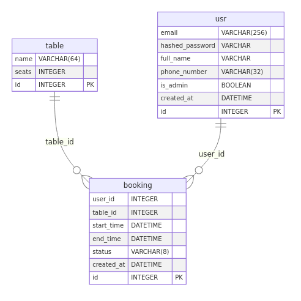

# Table Reservations

## Quick Start (Docker)
1) Make sure Docker and Docker Compose are installed.
2) Rename `example.env` to `.env`
3) Run:

```bash
docker compose up --build
```

- API: `http://localhost:8000`.
- Mailpit UI: `http://localhost:8025`.
- Prometheus: `http://localhost:9090`.
- Grafana: `http://localhost:3000` (admin/admin).

## Migrations and Initial Data
On container start `scripts/start.sh` does:
- `alembic upgrade head`
- `scripts/seed_tables.py` (creates tables only if none exist)
- `scripts/create_admin.py` (creates admin if missing)

Admin defaults (can be overridden via env):
- `ADMIN_EMAIL` = `admin@booking.com`
- `ADMIN_PASSWORD` = `12345678`


## Logging and Monitoring
- Vector tails `./logs/*.log` and prints them to its stdout.
- Prometheus scrapes `http://api:8000/metrics`.
- Grafana is preconfigured with the Prometheus datasource.

## Email Notifications
- Notifications are sent via Celery tasks (see `src/tasks/tasks.py`).
- Welcome email: sent after successful user registration.
- Booking reminder: scheduled 24 hours before booking start time. If the booking is less than 24 hours away, the reminder is not scheduled.
- Results can be seen in Mailpit: `http://localhost:8025`.

## ER Diagram
Generate ER diagram (Mermaid format):

```bash
poetry run python scripts/generate_er.py
```

Output: `docs/er.mmd`.

Generate ER diagram PNG (via mermaid-cli Docker image):

```bash
poetry run python scripts/generate_er_png.py
```
Output: `docs/er.png`.


## Tests
- Unit tests:

```bash
poetry run pytest tests/test_services.py
```

- Integration tests (SQLite + httpx):

```bash
poetry run pytest tests/integration
```
